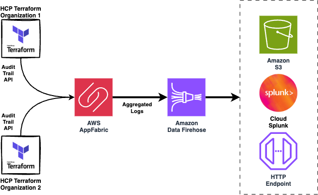

## Architecture

<picture>
  <source media="(prefers-color-scheme: dark)" srcset="images/architecture-dark.png">
  <source media="(prefers-color-scheme: light)" srcset="images/architecture-light.png">
  
</picture>

## Requirements

| Name | Version |
|------|---------|
|  [aws](#requirement\_aws) | 6.14.0 |
|  [tfe](#requirement\_tfe) | 0.69.0 |
|  [time](#requirement\_time) | 0.13.1 |

## Providers

| Name | Version |
|------|---------|
|  [aws](#provider\_aws) | 6.14.0 |

## Modules

| Name | Source | Version |
|------|--------|---------|
|  [audit\_configuration](#module\_audit\_configuration) | ./modules/log_configuration | n/a |

## Resources

| Name | Type |
|------|------|
| [aws_appfabric_app_bundle.this](https://registry.terraform.io/providers/hashicorp/aws/6.14.0/docs/resources/appfabric_app_bundle) | resource |
| [aws_iam_policy.firehose](https://registry.terraform.io/providers/hashicorp/aws/6.14.0/docs/resources/iam_policy) | resource |
| [aws_iam_role.firehose](https://registry.terraform.io/providers/hashicorp/aws/6.14.0/docs/resources/iam_role) | resource |
| [aws_iam_role_policy_attachment.firehose](https://registry.terraform.io/providers/hashicorp/aws/6.14.0/docs/resources/iam_role_policy_attachment) | resource |
| [aws_kinesis_firehose_delivery_stream.this](https://registry.terraform.io/providers/hashicorp/aws/6.14.0/docs/resources/kinesis_firehose_delivery_stream) | resource |
| [aws_s3_bucket.this](https://registry.terraform.io/providers/hashicorp/aws/6.14.0/docs/resources/s3_bucket) | resource |
| [aws_s3_bucket_public_access_block.this](https://registry.terraform.io/providers/hashicorp/aws/6.14.0/docs/resources/s3_bucket_public_access_block) | resource |
| [aws_s3_bucket_server_side_encryption_configuration.this](https://registry.terraform.io/providers/hashicorp/aws/6.14.0/docs/resources/s3_bucket_server_side_encryption_configuration) | resource |
| [aws_s3_bucket_versioning.this](https://registry.terraform.io/providers/hashicorp/aws/6.14.0/docs/resources/s3_bucket_versioning) | resource |
| [aws_caller_identity.current](https://registry.terraform.io/providers/hashicorp/aws/6.14.0/docs/data-sources/caller_identity) | data source |
| [aws_iam_policy_document.firehose_assume_role](https://registry.terraform.io/providers/hashicorp/aws/6.14.0/docs/data-sources/iam_policy_document) | data source |
| [aws_iam_policy_document.firehose_policy](https://registry.terraform.io/providers/hashicorp/aws/6.14.0/docs/data-sources/iam_policy_document) | data source |
| [aws_region.current](https://registry.terraform.io/providers/hashicorp/aws/6.14.0/docs/data-sources/region) | data source |

## Inputs

| Name | Description | Type | Default | Required |
|------|-------------|------|---------|:--------:|
|  [s3\_bucket\_name\_audit\_trail](#input\_s3\_bucket\_name\_audit\_trail) | The name of the S3 bucket to store audit trail logs | `string` | n/a | yes |
|  [terraform\_organizations](#input\_terraform\_organizations) | List of HCP Terraform organizations | `list(string)` | `[]` | no |

## Outputs

No outputs.
